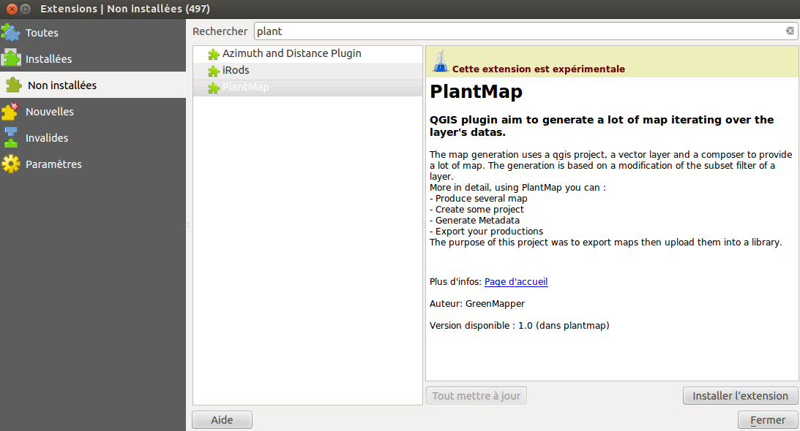

========================
Pour les développeurs
========================
Ce document a pour objectif de décrire les différents outils et API nécessaire à la poursuite du développement du plugin QGIS. Il permettra, dans une perspective d’évolution, de reprendre le développement dans un environnement similaire à celui que nous avons installé. Cette documentation relatera dans une première partie les outils indispensables à la poursuite du développement et dans une seconde partie l’organisation du code.

---------------------------------
L'environnement de développement
---------------------------------
Les outils présentés permettront de développer de nouvelles fonctionnalités et de mettre à jour l’application si nécessaire (QGIS 3.0 par exemple)

^^^^^^^
QGIS
^^^^^^^
L’outil développé par l’équipe s’appuie sur la suite logicielle QGIS, logiciel de type SIG, open source et gratuit. Le cœur du logiciel a été développé principalement à l’aide de C++ et offre une API utilisable en langage python et C++.

Installation : https://www.qgis.org/fr/site/forusers/alldownloads.html#debian-ubuntu

Si la version de python n’est pas à jour ou n’est pas installé : apt-get install python-qgis

Pour les novices dans le développement de plugin QGIS, les ressources suivantes peuvent être itnéressantes :
  * http://plugins.qgis.org/
  * http://docs.qgis.org/testing/en/docs/pyqgis_developer_cookbook/plugins.html

^^^^^^^^^^^^^^
Qtcreator
^^^^^^^^^^^^^^
QtCreator est un IDE qui permet de réaliser des applications multiplateformes. De ce fait, l’outil QtDesigner de la suite logiciel permet à l’aide d’un système de drag&drop de créer des interfaces utilisateurs de manière simple. Ces interfaces sont réalisées en XML et transformables en fichier interprétable par python (PyQT). Par ailleurs, c’est cette technologie qui est utilisée par QGIS lui-même pour designer ses interfaces.

Installation : http://www.qt.io/download/

^^^^^^^^^^^^^^^^^^^^^^^^^^^^^^^^^^^
SublimeText
^^^^^^^^^^^^^^^^^^^^^^^^^^^^^^^^^^^
Nous conseillons d’utiliser SublimeText un éditeur OpenSource reconnaissant python avec coloration syntaxique. Cependant il est toujours possible d’utiliser des IDE plus sophistiqué tels qu’Eclipse ou PyCharm.

Installation: https://www.sublimetext.com/3

^^^^^^^^^^
Sphinx 
^^^^^^^^^^
Cette documentation a été produite grâce au générateur de documentation Python Sphinx

Installation : http://www.sphinx-doc.org/

Pour les novices de Sphinx, les ressources suivantes peuvent être intéressantes :
  * http://www.sphinx-doc.org/en/stable/tutorial.html#adding-content
  * http://www.sphinx-doc.org/en/stable/rest.html#rst-primer
  * http://docutils.sourceforge.net/docs/ref/rst/restructuredtext.html#simple-tables

^^^^^^^^^^^^^^^^^^^^^^^^^^^^^^^^
Plugin Reloader (plugin QGIS)
^^^^^^^^^^^^^^^^^^^^^^^^^^^^^^^^
Cet outil est indispensable si une mise à jour du plugin est prévue. En effet, cet outil est un plugin QGIS qui permet de recompiler le code et de relancer l’application de manière simple et efficace. 

Installation :

  * Ouvrir QGIS
  * Se rendre dans le menu “Extention -> Installer/Gérer les extensions”
  * Rechercher “plugin reloader”
  * Installer

Ensuite, lors d’un changement dans le code du plugin, il suffit de sélectionner le plugin modifié en cliquant sur l’icône du plugin reloader.

---------------------------------
Fonctionnement du plugin
---------------------------------
^^^^^^^^^^^^^^^^^^^^^^^^^^^^^^^^^^^^^
Modal et traitement long (Thread)
^^^^^^^^^^^^^^^^^^^^^^^^^^^^^^^^^^^^^
Afin d’exécuter des traitements longs, nous utilisons dans notre plugin une modal prenant en paramètre une Thread qui sera exécutée au sein de la modal. Nous utilisons cette organisation dans trois conditions : 	
  * Lors de l’importation d’un fichier CSV
  * Lors de la vérification avancée de présence d’un taxon
  * Lors de la génération des cartes

Le traitement long est, dans les trois conditions, arrêtable via le bouton “Cancel” de la modal. Si le traitement long n’est pas fini, la modal proposera de l’arrêter. L'arrêt d’un thread peut demander quelques secondes.

^^^^^^^^^^^^^^^^^^^^^^^^^^^^^^^^^^^^^
Worker
^^^^^^^^^^^^^^^^^^^^^^^^^^^^^^^^^^^^^
Un Worker correspond à la classe abstraite à utiliser afin de mettre en place une Thread utilisable par la modal. Cette classe abstraite contient des arguments et des méthodes déjà misent en places et deux méthodes à implémenter afin de mettre en place un Worker spécifique, “run()” et “getResult()”. Le Worker est situé dans le fichier IplantMapThread.py, classe PlantMapThreadInterface. Il est nécessaire d’étendre cette classe afin de créer et mettre en place son propre Worker.

L’arrêt du Worker est en mode passif, cela permet au développeur de contrôler et de sécuriser l’arrêt de la Thread. Afin de tester si la demande d’arrêt de la Thread est réalisée, il est nécessaire de tester la valeur retournée par la méthode “isKilled()” (retourne True si la demande est réalisée). Cette méthode peut, par exemple, être testée à chaque tour de boucle afin de sortir de la boucle en toute sécurité.

Afin de loguer un message au sein d’un thread, il est interdit d’utiliser directement la classe Logger pour des raisons de concurrences et d’interactions avec l’interface graphique. Afin de loguer un message au sein d’un worker, utilisez la méthode suivante : 

==> self.logProgress.emit(Logger.[LEVEL], u”[message]”)

Par exemple : self.logProgress.emit(Logger.INFO, u"Traitement en cours ")

Afin de mettre à jour la barre de progression de la modal, un Timer est livré avec la classe abstraite (Timer.py, classe Timer). Le Timer doit être initialisé au début du traitement long grâce à la méthode timerInit, prenant en paramètre le nombre d’opérations à réaliser. Le Timer doit ensuite être mis à jour à chaque opération réalisée grâce à la méthode timerNewTurn() (A chaque tour de boucle par exemple). Enfin, la méthode timerEnd() permet d’indiquer la fin du traitement au Timer.

Méthodes à implémenter :
  * run() :  Obligatoire, correspond à l’implémentation du code qui sera exécuter par le thread
  * getResult() : Facultatif, permet de retourner un résultat une fois le traitement du thread fini.

Méthodes du Worker utilisées par la modal (déjà implémentées) :
  * kill() : Permet de changer l’état du paramètre “killed” à True

Méthodes à utiliser au sein de la méthode run() (déjà implémentées) :
  * isKilled() : Méthode retournant True si la demande d’arrêt du Thread est réalisée (A tester régulièrement afin de pouvoir gérer l’arrêt du Thread)
  * timerInit(int) : Méthode permettant d’initialiser le timer. Prend en paramètre le nombre total d’opérations à réaliser
  * timerNewTurn() : Permet d’indiquer qu’une opération est réalisée et mettre à jour l’état du timer
  * timerEnd() : Permet d’indiquer que toutes les opérations sont réalisées

^^^^^^^^^^^^^^^^^^^^^^^^^^^^^^^^^^^^^
Logger
^^^^^^^^^^^^^^^^^^^^^^^^^^^^^^^^^^^^^

Le Logger permet d’historiser toutes les informations liées au plugin et à la génération des cartes. Le logger est un singleton, la même instance est donc utilisable partout dans le plugin. Les trois méthodes “debug”, “info” et “error” permettent d’historiser un message suivant sa priorité. 
Les deux méthodes “addOuput” et “removeOutput” permettent d’ajouter ou supprimer des handlers. En effet, le logger est basé sur un système d’inscription via des handler. Un handler permet de décrire de quelle manière sera traité un logue. Par exemple, le handler FileHandler décrit la manière dont tous les logs seront redirigés vers un fichier, le handler TextEditandler décrit la manière dont tous les logs seront redirigés vers un QTextEdit.
Un handler est instanciable grâce à la classe abstraite “HandlerInterface” au sein du fichier handlers.py. Un handler doit être ensuite ajouté au Logger afin que le logger le prenne en compte.
 
-------------------------------------
Les classes fonctionnelles du plugin
-------------------------------------

^^^^^^^^^^^^^^^^^^^^^^^^^^^^^^^^^^^^^
Vérification avancée
^^^^^^^^^^^^^^^^^^^^^^^^^^^^^^^^^^^^^
contient la classe deepValidation qui a pour rôle de réaliser une vérification avancée et permet de outre passé les possibles filtres indiqués sur la couche QGIS afin de contrôler si un taxon est présent en base ou non. Cette classe étend la classe PlantMapThreadInterface, c’est un Worker qui sera exécuté dans la modal et répond donc aux exigences citées précédemment.

Cette fonction suit les directives suivantes :
  * Récupère et efface le filtre de la couche.
  * Test pour toutes les IDs présents dans la liste de taxons si celui-ci est présent dans la couche.

Enfin, la fonction remet en place le filtre.

^^^^^^^^^^^^^^^^^^^^^^^^^^^^^^^^^^^^^
Chargement CSV
^^^^^^^^^^^^^^^^^^^^^^^^^^^^^^^^^^^^^
contient la classe loadCSV qui a pour rôle de charger un fichier CSV contenant la liste des taxons à traiter. Cette classe étend la classe PlantMapThreadInterface, c’est un Worker qui sera exécuté dans la modal et répond donc aux exigences citées précédemment.
La liste de taxons doit être présente dans la 1ere colonne du fichier. Les autres colonnes ne seront pas prisent en compte.

^^^^^^^^^^^^^^^^^^^^^^^^^^^^^^^^^^^^^
Export 
^^^^^^^^^^^^^^^^^^^^^^^^^^^^^^^^^^^^^
contient la classe Export qui permet de compresser un dossier contenant des images préalablement générées avec le plugin afin de les importer dans la cartothèque via l’onglet de la cartothèque prévu à cette effet.
Le processus d’export récupère la liste des images et des métadonnées comprises dans le dossier sélectionné puis réalise une intersection afin d’exporter seulement les images ayant des métadonnées et inversement. L’export consiste ensuite en la création d’une archive zip contenant les fichiers résultants de l’intersection.

^^^^^^^^^^^^^^^^^^^^^^^^^^^^^^^^^^^^^
qgis_utils.py
^^^^^^^^^^^^^^^^^^^^^^^^^^^^^^^^^^^^^
contient les fonctions qgis utilisées à travers le plugin afin de faciliter au mieux un changement de version. Certaines fonctions QGIS peuvent néanmoins se trouver dans certains fichiers.

^^^^^^^^^^^^^^^^^^^^^^^^^^^^^^^^^^^^^
Generation
^^^^^^^^^^^^^^^^^^^^^^^^^^^^^^^^^^^^^
Le fichier mapgenerator.py contient la classe GeneratorMap qui a pour rôle de générer la liste de taxons. Cette classe étend la classe PlantMapThreadInterface, c’est un Worker qui sera exécuté dans la modal et répond donc aux exigences citées précédemment.

La classe prend deux paramètres lors de son instanciation : 
  * genData : Objet contenant toutes les informations relatives à la génération (liste de taxons, composer, layer, dossier de stockage, …). La classe de l’objet genData est située dans le fichier generationData.py, classe generationData.
  * listMetadataToCreate : Liste contenant toutes les métadonnées liées à un projet. Cette liste est créée à partir du fichier xml représentant un projet.

A l’initialisation, la classe créer un fichier CSV au sein du dossier de stockage comprenant la liste des taxons qui sera générée (fichier réutilisable dans le plugin). La classe créer également un fichier generation_info_[date].json au sein du dossier metadata, ce fichier contient toutes les informations relatives à la génération.

La méthode run() de la classe boucle sur la liste de taxon. Pour chaque taxon, deux parties principales sont réalisées :
  * Génération de carte : Cette partie contient trois actions importantes :
  * set_subsetstring(Layer, newFiltre) : Modifie et adapte le filtre de la couche afin de ne récupérer que les taxons en cours de traitements
  * composer_printPageAsRaster(Composer) : Met à jour le composer
  * composer_saveImage(path, ext) : Sauvegarde le composer
  * Génération des métadonnées : Cette partie contient trois actions importantes :
  * populate_json_object(taxon, description) : Créer un objet JSON comprenant toutes les métadonnées pour un taxon
  * MetadataWriter(fileName, path, json) : Prépare l’écriture du fichier JSON
  * process() : sauvegarde les métadonnées sur le disque.

Si, lors de la génération, la connexion à la couche de taxons en base de données est perdue, le plugin sera bloqué en attendant de retrouver la connexion. Même si l’utilisateur clique sur “Cancel” et souhaite couper le thread, le plugin sera en attente et ne répondra plus temps que la connexion ne sera pas retrouvée. Cet effet est du à QGIS qui ne propose pas de TimeOut sur les méthodes suivantes :
  * setSubsetString (sur le layer taxon)
  * printPageAsRaster (sur le composer)
  
---------------------------------
L'organisation des fichiers
---------------------------------

^^^^^^^^^^^^^^^^^^^^^^^^^
Les différents dossiers
^^^^^^^^^^^^^^^^^^^^^^^^^
Le dossier comportant le code du plugin rassemble toutes les fonctions, classes et méthodes à la racine du dossier.
Le dossier présente plusieurs dossiers :

=======   ============
Dossier   Description
=======   ============
i18n      fichiers pour l'internationalisation du plugin (anglais, français)
img       images utilisées dans la documentation
project   fichiers XML décrivant les projets définis dans le plugin
scripts   quelques scripts shell divers 
test      tests unitaires
=======   ============

^^^^^^^^^^^^^^^^^^^^^^^^^^^^^^^
Les fichiers de développement
^^^^^^^^^^^^^^^^^^^^^^^^^^^^^^^
Ces fichiers sont utilisé majoritairement dans le cadre du développement du plugin

================  ===================
Fichier           Description
================  ===================
.travis.yml        YML utilisé pour faire les test unitaires (https://docs.travis-ci.com/)
Makefile          Fichier facilitant la gestion de la compilation du pugin
pb_tool.cfg.txt   Configuration file for plugin builder tool (pb_tool)
plugin_upload.py  This script uploads a plugin package on the server
pylintrc          Pylint is a tool that checks for errors in Python code
qgis_utils.py     contient les fonctions qgis utilisées à travers le plugin afin de faciliter au mieux un changement de version. Certaines fonctions QGIS peuvent néanmoins se trouver dans certains fichiers.
================  ===================

^^^^^^^^^^^^^^^^^^^^^^^^^^^^^^^
Les interfaces
^^^^^^^^^^^^^^^^^^^^^^^^^^^^^^^
Ces fichiers sont constitues les 

==========================   ======================================================================================================================    ====================================================================================================================
Fichier                      Description                                                                                                               Classes et méthodes
==========================   ======================================================================================================================    ====================================================================================================================
handlers.py                  permet de gerer le lien entre l'interface et les logs                                                                     HandlerInterface(close, emit), FileHandler(__init__, close, emit), TextEditHandler (__init__, close, emit)
plantmap.py                  QGIS Plugin Implementation : initialise les composants de l’interface graphique avec les informations du projet QGIS      PlantMap (__init__, tr, add_action, initGui, unload, run, set_layers_list, set_field_description_layer, set_composer_list)
plantmap_dialog.py           instancie et fait le lien avec plantmap_dialog_base.py                                                                    PlantMapDialog(__init__,next, prev, next2, prev2, check_where_editable, check_state_map_name, check_state_date, check_state, check_state_description, check_state_email, check_state_project_name, put_to_false, deep_validation, stockage_file_dialog, taxon_list_file_dialog, export_file_dialog, export, select_project, set_project_selection_combobox, test_sender, valide_select_project, get_project_from_xml, validate_project_creation, fill_project_field, fill_project_tab, validate_export, validate_taxon, validate_remove_all, validate_map_generation, new_add_taxon_to_board, refresh_taxon_board, check_type, check_isString, error_message, en_of_generate, generate)
plantmap_dialog_base.py      compilation plantmap_dialog_base.ui (pyuic4)                                                                              Ui_PlantMapDialogBase
plantmap_dialog_base.ui      XML : interface générale du plugin issu de QTCreator                                                                      ..
plantmap_progress.py         instancie et gère plantmap_progress_base.py. This class is a modal for the plugin.                                        This modal block Qgis and plugin for execute a long task in a thread	PlantMapProgress(__init__, postLog, setProgressBar, closeEvent, end)
plantmap_progress_base.py    compilation plantmap_progress_base.ui (pyuic4)                                                                            Ui_PlantMapDialogBase
plantmap_progress_base.ui    XML : interface de la modal issu de QTCreator                                                                             ..
==========================   ======================================================================================================================    ====================================================================================================================

^^^^^^^^^^^^^^^^^^^^^^^^^^^^^^^^^^^^^^^^^^
Les différentes classes et méthodes
^^^^^^^^^^^^^^^^^^^^^^^^^^^^^^^^^^^^^^^^^^
Ces fichiers sont constitues le coeur du plugin.

==========================   ============================================================================================================================================   ====================================================================================================================
Fichier                      Description                                                                                                                                    Classes et méthodes
==========================   ============================================================================================================================================   ====================================================================================================================
__init__.py                  This script initializes the plugin,  making it known to QGIS.                                                                                  Def classFactory
deepValidationProcess.py     permet de vérifier la présence d'un taxon dans les données sources (modifie le statut de présence).                                            deepValidation (__init__,  run,  getResult)
export.py                    permet de créer un zip avec les cartes et les métadonnées                                                                                      Export(__init__, process, fill_list_of_img, fill_list_of_metadata, intersect_list_image_metadata, createZip)
generationData.py            constructeur des paramètres de production de la carte (metadata of a generation)                                                               generationData(__init__)
IexternalProcessThread.py    permet de gerer le lien entre le pré et post traitement lors des actions d'import de CSV,  de recherche avancée et de production de cartes     externalProcessThreadInterface(before, after),  loadCSVExternalProcess (__init__, before, after),  deepExternalProcessValidation(__init__, before, after),  generatorMapExternalProcess(__init__, before, after)
IplantMapThread.py           Gestion du Worker                                                                                                                              PlantMapThreadInterface
loadCSVProcess.py            permet de charger une liste de taxon                                                                                                           loadCSV(__init__, run, getResult)
Logger.py                    This class Logger propose to log with 3 level for 3 output Level : DEBUG | INFO | ERROR
                             The Logger used handlers. You can create handlers and added this with class Handlers                                                           Logger(__new__, __init__, addOutput, removeOutput, debug, info, error)
manageUIListTaxon.py         Manage all the taxon in the UI list and in the list for generation. This class is an singleton,  
                             but the singleton fonctionnalities are not used for the moment.                                                                                ManageUIListTaxon(__new__, __init__, initManager, getListOfTaxon, addTaxon, refreshTaxonTab, removeAll, handler_remove_button)
mapgenerator.py              lance la génération des toutes les cartes                                                                                                      GeneratorMap(__init__, create_json_project_qgis, to_JSON, getResult, run, get_value_from_metadata, populate_json_object)
metadata_writer.py           Créer les métadonnées des cartes                                                                                                               MeadataWriter(__init__, process, create_dir_metadata, write)
plantmap_engine.py           Ensemble de méthodes variées                                                                                                                   plantMapEngine(__init__, get_description, project_path, get_project, get_all_field_from_project, check_project_name, parsingKeyWords, edit_taxon_tab, load_xml, ) ObjectJSON(to_JSON)
plantMapXML.py               Création,  lecture des projet (XML)                                                                                                            plantMapXML(xml_writer, parse_xml, prettify)
project.py                   This class represents a project of the plugin                                                                                                  Project(__init__)
timer.py                     This class calculate the time and the percent for finish a process                                                                             Timer(__init__, newTurn, computeTimeProgress, computePercentProgress)
==========================   ============================================================================================================================================   ====================================================================================================================

^^^^^^^^^^^^^^^^^^^^^^^^^^^^^^^^^^^^^^^^^^^^^^
Les fichiers de configurations / métadonnées
^^^^^^^^^^^^^^^^^^^^^^^^^^^^^^^^^^^^^^^^^^^^^^
Ces fichiers permettent de configurer le plugin au besoin.

================  ===============================================================================================
Fichier           Description
================  ===============================================================================================
_project          XML décrivant le plugin
_pydevproject     XML ?
icon.png          Icone pour le bouton du plugin dans l'interface de QGIS
LICENSE           GNU GENERAL PUBLIC LICENSE Version 3,  29 June 2007
metadata.txt      description du plugin affiché dans la bbliothèque des plugin
resources.py      The translation of the .qrc file described above to Python.
resources.qrc     The .xml document created by Qt Designer. Contains relative paths to resources of the forms.
================  ===============================================================================================

---------------------------------
Développement et déploiement
---------------------------------
  * Récupérez les sources sur le dépot Github du projet : https://github.com/Max77T/plantmap-plugin
  * Compilez le plugin en utilisant pyrcc4
  * Pour être identifié par QGIS, le plugin doit être placé dans le dossier C:/Users/[nom_de_l_utilisateur]/.qgis2/python/plugins/ (sous windows) ou .qgis2/python/plugins/ (sous linux)
  * Réalisez les modifications souhaitées
  
   * Modifier le fichier d'implémentation : plantmap.py
   * Modifier l'interface utilisateur à partir de PlantMap.ui avec Qt Designer
   
  * Utilisez Makefile tpour compiler le projet avec ses interfaces. Cete étape nécessite GNU make (gmake)
  * Réalisez les tests (make test)
  * Testez le plugin en l'activant dans le gestionnaire des extension de QGIS
  
Pour plus d'information, veuillez consulter le PyQGIS Developer Cookbook : http://www.qgis.org/pyqgis-cookbook/index.html

^^^^^^^^^^^^^^^^^^^^^^^^^^^^^^^^^^^^^
Modifier la description du plugin
^^^^^^^^^^^^^^^^^^^^^^^^^^^^^^^^^^^^^
Cette partie a pour but de modifier la description du plugin à l’installation

Il faut modifier le fichier metadata.txt présent dans les sources du plugin.

^^^^^^^^^^^^^^^^^^^^^^^^^^^^^^^^
Compiler les intefaces
^^^^^^^^^^^^^^^^^^^^^^^^^^^^^^^^
Pour modifier une interface (UI), il est recommandé d’utiliser QtCreator4 qui permet à l’aide de drag and drop de widget de modifier l’interface.
A chaque modification de l’interface graphique via QTCreator, il est donc nécessaire de compiler le fichier .ui. Afin de compiler un fichier .ui en .py, nous utilisons la commande suivante ::
	
	pyuic4 plantmap_dialog_base.ui -o plantmap_dialog_base.py

Deux classes python instancies et gères ces deux interfaces, respectivement : 
  * plantmap_dialog.py
  * plantmap_progress.py

Les interfaces sont passées en paramètres de classe.
Nous avons préfixés tous les objets graphiques par “UI_[nomDeLObjet] afin de les différencier facilement au sein du code python.
