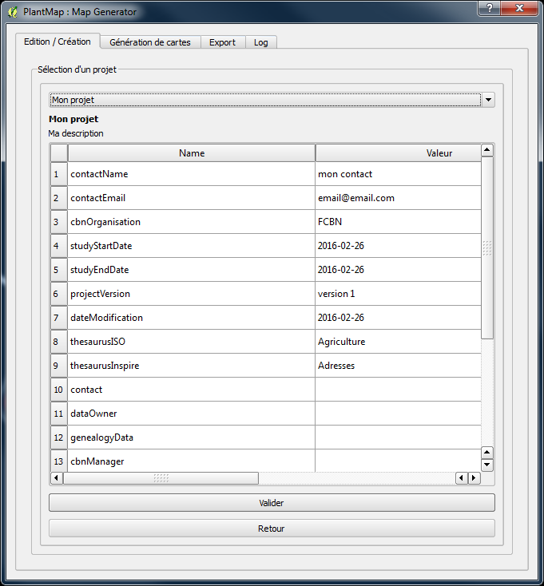
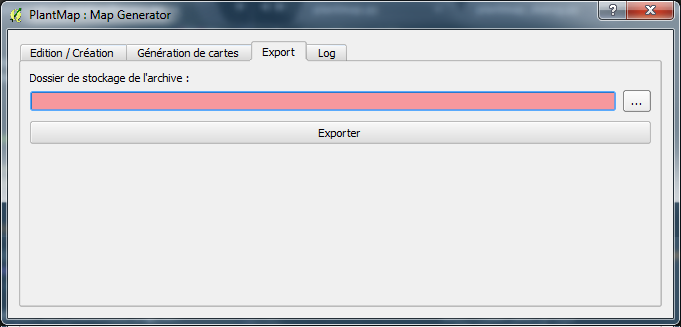

=======================
Pour les utilisateurs
=======================
Le plugin Plantmap permettra aux utilisateurs de générer des cartes en grande quantité de manière simple et robuste.

Cette partie a pour objectif de 
  * définir la méthode d’installation et de déploiement du plugin QGIS sur un poste utilisateur. 
  * de détailler le fonctionnement du plugin afin de générer une série de cartes.

La documentation de mise en production proposera une installation multi OS (UNIX et Windows) étant donné la compatibilité de QGIS avec les systèmes précédemment cités. Le déploiement pourra se faire selon les modélités suivantes : Installation depuis le serveur PlantMap (et à terme le répository QGIS, Installation via les sources).
Le plugin a été testé sur :
  * Windows 7 avec QGIS 2.0 (non compatible), 2.8 et 2.12 (nous n’avons pas testé la compatibilité avec les versions intermédiaires)
  * Linux 12.04 avec QGIS 2.12, QGIS 2.14

Pour des raisons de compatibilité, il est préférable d’installer le plugin sur une session ne comportant pas de caractères spéciaux.

---------------------------------
Installer le plugin
---------------------------------

^^^^^^^^^^^^^^^^^^^^^^^^^^^^^^^^^^^^^^^^^^^^^
Installation depuis le depot QGIS
^^^^^^^^^^^^^^^^^^^^^^^^^^^^^^^^^^^^^^^^^^^^^
Si le plugin est accepté, il sera disponible directement à travers le gestionnaire des extensions de plugin. Il suffit alors de l'installer à travers cette interface.

**ATTENTION** : Possible effet de bord = pour plus de sécurité, il est préférable d’installer un second plugin prénommé “Plugin Reloader”. Ce plugin permettra de recompiler le plugin “PlantMap” si une erreur survient et de lui rendre son état d’origine.

^^^^^^^^^^^^^^^^^^^^^^^^^^^^^^^^^^^^^^^^^^^^^
Installation depuis les fichiers sources
^^^^^^^^^^^^^^^^^^^^^^^^^^^^^^^^^^^^^^^^^^^^^
L’installation via les sources consiste a décompressée les sources dans un dossier précis qui sera interprété par QGIS comme étant un plugin
  * Récupérez les sources sur le dépot Github du projet : https://github.com/Max77T/plantmap-plugin
  * Compilez le plugin en utilisant pyrcc4
  * Pour être identifié par QGIS, le plugin doit être placé dans le dossier C:\Users\[nom_de_l_utilisateur]\.qgis2\python\plugins (sous windows) ou .qgis2/python/plugins/ (sous linux)
Attention, ils est nécessaire de redémarrer QGIS pour que le plugin soit reconnu.

Après avoir lancé QGIS, il se peut que le plugin soit désactivé pour remédier à cela, il faut se rendre dans le menu “Extension”. La checkbox “PlantMap” doit être coché. Une fois coché le plugin sera visible dans la barre des plugins.

**ATTENTION** : Possible effet de bord = pour plus de sécurité, il est préférable d’installer un second plugin prénommé “Plugin Reloader”. Ce plugin permettra de recompiler le plugin “PlantMap” si une erreur survient et de lui rendre son état d’origine.

---------------------------------
Créer/éditer un projet
---------------------------------
Un projet rassemble les informations qui ont poussées à générer un ensemble de cartes. Les informations décrites dans un projet seront, par la suite, réutilisées pour faciliter la recherche de carte dans le cas ou de nombreux projets sont réalisées. Les informations générales d'un projet sont : son nom, sa description, le contact de la personne référente sur ce projet, le propriétaire de la données...

Le but de cette partie est de stocker les métadonnées lié à un projet. L’utilisateur doit impérativement renseigner les champs en rouge et peut s’il le souhaite inscrire les métadonnées Inspire. Ces données seront générées lors de la génération des cartes et permettront dans la cartothèque de rechercher ces mêmes cartes.

^^^^^^^^^^^^^^^^^^^^^^^^^^^^^^^^^^^
Creation depuis un projet existant
^^^^^^^^^^^^^^^^^^^^^^^^^^^^^^^^^^^
L’utilisateur a la possibilité de créer un projet à partir d’un autre afin d’alléger le travail du géomaticien. Il devra sélectionner un projet parmi la liste déroulante et le choisir en fonction des données affichées dans le tableau. Une fois son choix fait, il pourra le valider et sera rediriger vers la page de création de projet où le nom du projet et la description devront être obligatoirement complétés.

^^^^^^^^^^^^^^^^^^^^^^^^^^^^^^^^^^^
Édition depuis un projet existant
^^^^^^^^^^^^^^^^^^^^^^^^^^^^^^^^^^^
Comme pour la création à partir d’un projet existant, pour éditer un projet l’utilisateur devra sélectionner un projet. La validation redirigera encore une fois l’utilisateur vers la création de projet où il pourra éditer tous les champs hormis le nom du projet.

---------------------------------
Génération de cartes
---------------------------------
L’onglet “Génération de cartes” permet de configurer et de lancer le processus de génération de cartes en masse.

Cet onglet est divisé en 3 sous-parties :
  * Données d’entrées, soit les informations sur lesquelles la génération va s’appuyer
  * Liste de taxons, les données qui varieront lors du processus
  * Données en sortie, soit les produits résultant de la génération

^^^^^^^^^^^^^^^^^^^^^^^^^^^^^^^^^^^^^^^^^^^^^
Paramétrer les données d'entrées
^^^^^^^^^^^^^^^^^^^^^^^^^^^^^^^^^^^^^^^^^^^^^

Cette sous-partie permet à l'utilisateur d’indiquer différents paramètres:
  * Projet : Permet d’indiquer sur quel projet s’appuie la génération (les métadonnées générées seront liées au choix du projet)
  * Couche taxon : Permet d’indiquer la couche sur laquelle la génération effectuera les itérations.
  * Champ d’itération : Permet de sélectionner le champ de la couche (précédemment sélectionnée) sur lequel la génération s'appuiera pour les itérations.
  * Champs de description : Permet d’indiquer le champ de description d’un taxon.
  * Filtrage complémentaire : Permet d’indiquer un filtre complémentaire au layer sélectionné dans le champ “Couche taxon”. En effet, tous les filtres appliqués à cette couche sur le projet QGIS ne seront pas pris en compte lors de la génération. Ce champ permet donc d’affiner, si besoin, la couche de données d’entrée.

Ces informations seront ajoutées à la liste des métadonnées lors de la génération des cartes. Les métadonnées permettront ensuite de réaliser des recherches côté cartothèques.
Une fois les données d’entrée configurées, rendez-vous dans la sous partie “Liste de taxons”

^^^^^^^^^^^^^^^^^^^^^^^^^^^^^^^^^^^^^^^^^^^^^
Définir la liste de taxons
^^^^^^^^^^^^^^^^^^^^^^^^^^^^^^^^^^^^^^^^^^^^^

Cette sous partie permet à l’utilisateur d’indiquer la liste de taxons sur laquelle la génération s’appuiera.
  * L’ID correspond à l’identifiant d’un taxon, en correspondance avec le champ sélectionné dans “Champs d’itération”.
  * La description correspond à la description d’un taxon en cohérence avec le champ sélectionné dans “Champs de description”.
  * Le Statut permet d’indiquer si l’ID est présent ou non dans la couche sélectionnée dans “Couche taxon”.
  * Supprimer permet de supprimer un taxon.

L’ajout d’un taxon s’appuiera également sur le filtrage complémentaire que l’utilisateur aura renseigné.

Plusieurs actions sont à disposition de l’utilisateur afin de gérer votre liste de taxons :
  * Le premier bloc et le bouton "valider le taxon" permet d’ajouter des taxons un par un,
  * Le bouton "charger un fichier" permet de charger un fichier CSV contenant une liste de taxons. Ce fichier CSV doit contenir dans la première colonne le champ correspondant au champ indiqué dans “Champ d’itération”. Le séparateur du fichier CSV doit être un ‘;’. Les autres colonnes du fichier CSV ne seront pas prisent en compte,
  * le bouton "Supprimer tous les taxons" permet de vider la liste des taxons,
  * le bouton "Verif. avancée" permet de réaliser une vérification avancée de la présence (ou non) d’un taxon dans la couche indiquée en paramètre. En effet, si la couche contient un filtre, les boutons précédents ne rechercheront que dans les données résultantes du filtre. Le bouton “Vérif. Avancée” permet de rechercher la présence (ou non) d’un taxon au-delà du filtre sur la couche QGIS. (Le filtre restera inchangé une fois le processus terminé).
  
Une fois la liste de taxons configurée, rendez-vous dans la sous partie “Données en sortie”.

^^^^^^^^^^^^^^^^^^^^^^^^^^^^^^^^^^^^^^^^^^^^^
Paramétrer les données en sortie
^^^^^^^^^^^^^^^^^^^^^^^^^^^^^^^^^^^^^^^^^^^^^

Cette sous partie permet de configurer les paramètres de création des images.
  * "Choisir un composeur" permet de sélectionner le composeur QGIS qui sera utilisé pour créer les images résultantes,
  * "Format de carte en sortie" permet de sélectionner le format de sortie des images résultantes,
  * "Nom de la carte en sortie" permet de configurer le nom des images résultantes. Ce nom sera concaténé avec l’ID du taxon généré. Le nom de cartes de doit pas comporté de caractères spéciaux,
  * "Dossier de stockage" permet de configurer le dossier dans lequelle les images et les métadonnées seront générés. Le dossier ne doit pas comporter de caractères spéciaux.

^^^^^^^^^^^^^^^^^^^^^^^^^^^^^^^^^^^^^^^^^^^^^
Lancer la génération
^^^^^^^^^^^^^^^^^^^^^^^^^^^^^^^^^^^^^^^^^^^^^
Le bouton “Générer les cartes” permet de valider les informations entrées par l’utilisateur puis lancer le processus de génération.
Par ailleurs, la génération ne prend pas en compte les taxons aux statuts “NOK” et le filtre appliqué à la couche. Si on souhaite tout de même appliqué un filtre, il faut renseigner le champ filtrage avancée.

^^^^^^^^^^^^^^^^^^^^^^^^^^^^^^^^^^^^^^^^^^^^^
Les filtres Qgis et les filtres du plugin
^^^^^^^^^^^^^^^^^^^^^^^^^^^^^^^^^^^^^^^^^^^^^
Les filtres Qgis et le filtrage complémentaire proposé dans notre plugin ont des fonctionnalités spécifiques tout au long de l’utilisation de notre plugin.
Ici, le filtre Qgis correspond aux filtres applicables sur une couche d’un projet Qgis lorsqu’on sélectionne une couche, puis menu “Couche” et enfin “Filtrer ...”
Le filtre complémentaire correspond aux filtres indiqués au sein du plugin PlantMap, onglet génération.

Différenciation des filtres au sein du plugin :
  * Lorsque l’utilisateur ajoute un taxon depuis le bouton “Valider un taxon” ou depuis un fichier CSV grâce au bouton “Charger un fichier …”, le filtre Qgis appliqué sur une couche est pris en compte ainsi que le filtre complémentaire du plugin. Si vous ajoutez un taxon qui n'apparaît pas dans la couche Qgis, son statut sera “NOK”.
  * Lorsque l’utilisateur choisi de réaliser une vérification avancée grâce au bouton “Vérif. Avancée”, seul le filtre complémentaire du plugin est pris en compte. (Le filtre appliqué sur la couche Qgis est suspendu.)
  * Lorsque l’utilisateur exécute la génération de cartes grâce au bouton “Générer les cartes”, seul les cartes ayant le statut “OK” seront générées et seul le filtre complémentaire du plugin sera pris en compte. (Le filtre appliqué sur la couche Qgis est suspendu.)

Cette configuration permet à l’utilisateur de travailler sur une couche ayant un très grand nombre de données, de filtrer cette couche lors de sa mise en forme sur Qgis puis prendre en compte toute la donnée à la génération.
Si un filtre particulier doit être ajouté à la génération, il doit être indiqué dans la partie “Filtrage avancée” du plugin pour être pris en compte.

---------------------------------
Stopper un processus
---------------------------------
Lors de la génération de cartes, du chargement d’un fichier CSV et de la vérification avancée, une modal est mise en place afin de réaliser le traitement et indiquer à l’utilisateur l’état d’avancement de ce traitement. 
Lorsque la modal est activée, les interfaces du plugin et de Qgis sont bloquées pour des raisons de stabilités du traitement.
Il est possible d’arrêter le traitement et fermer la modal à tout moment grâce au bouton “Cancel”.

---------------------------------
Export d'un ensemble de carte
---------------------------------
L’onglet “Export” permet d’exporter un ensemble de carte préalablement générées dans le but d’importer ses cartes au sein de la cartothèque.

---------------------------------
Accéder aux logs
---------------------------------
L’onglet “Log” permet de visualiser la totalité des logs générés par le plugin.
Les logs sont également disponibles dans le fichier “log.txt” au sein de votre dossier de génération de cartes.

